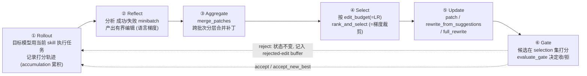

**问题**: microsoft/SkillOpt 是什么、如何工作、架构与组件、工程成熟度，以及其效果声称的证据等级如何？
**深度**: Deep
**核心结论**: SkillOpt 把训练神经网络的整套范式（epoch/batch/learning rate/梯度累积/验证门/动量/元学习）搬到"优化一份自然语言技能文档"上、模型权重全程冻结，产物是 300–2000 token、零推理开销的 `best_skill.md`；该 DL 类比在源码中真实落地，但其跨 52 单元的基准性能为作者自报、本研究未独立复现。
**产物类型**: supporting
**验证状态**: external-call tested（本会话内通过 GitHub API / raw 源码 / docs / 官网 fetch 验证）
**开放问题**: 4 - 见文末

> 调研对象：<https://github.com/microsoft/SkillOpt>　提交时仓库状态：创建于 2026-05-08，MIT，Python，~9997 stars / 940 forks，v0.1.0 已上 PyPI，论文 arxiv 2605.23904，homepage `aka.ms/skillopt`。
> 这是一份外部仓库（External Investigation）调查，非本项目 canonical 真理源。

## TL;DR

- **一句话**：像训练神经网络一样训练 agent 的 skill 文档，权重冻结，只改文本。
- **机制可信**：六阶段循环（rollout→reflect→aggregate→select→update→gate）+ DL 映射表在代码中逐项对应，内部训练器类名即 `ReflACTTrainer`，`edit_budget` 注释直接写着 "learning rate"。
- **效果存疑（未复现）**：+23.5/+24.8/+19.1 分、"best/tied-best 覆盖 52 单元"均为作者自报，本研究未运行评测、未取到逐单元明细表。
- **可落地的衍生品**：`skillopt_sleep` —— 让编码 agent 在"睡觉时"回顾真实会话、巩固自己的 CLAUDE.md（preview 特性，已有 Claude Code 插件 + hooks + cron）。
- **风险点**：GPT-5.5 等模型标识在知识截止后，无法独立确认；文档"Gate patience≈early stopping"与代码（恒跑满 num_epochs、无显式早停）有出入。

---

## 1. 它是什么 / 解决什么问题

智能体的 skill / CLAUDE.md / system prompt 通常是**手写或一次性生成**的，缺乏可靠的迭代改进机制。SkillOpt 把这份文档当作**可训练的状态**：让冻结的目标模型在打分任务上跑 rollout，由一个独立的 optimizer 模型把"哪里做错了"翻译成对文档的有界编辑（add/delete/replace），仅当**留出验证集（selection split）上分数提升**时才接受改动。最终输出一个紧凑、零额外推理开销的 `best_skill.md`。

官方定位（README 逐字）：*"SkillOpt is a text-space optimizer that trains reusable natural-language skills for frozen LLM agents through trajectory-driven edits, validation-gated updates, and deployable best_skill.md artifacts."*

## 2. 机制：DL ↔ 文本的映射（已读 `docs/guide/dl-analogy.md` 逐字核对）

| 深度学习概念 | SkillOpt 对应物 | 代码落点（本会话已读/已定位） |
|---|---|---|
| 模型权重 | 技能文档（Markdown） | `optimizer/skill.py` |
| 前向传播 | Rollout | `envs/*/rollout.py`, `adapter.rollout()` |
| 损失函数 | 任务评估器 | `envs/*/evaluator.py`, `utils/scoring.py` |
| 反向传播 | Reflect（语言空间梯度） | `gradient/reflect.py` |
| 梯度 | 编辑补丁（Edit patches） | `types.py: Edit / Patch` |
| 梯度累积 | 补丁聚合 | `gradient/aggregate.py: merge_patches` |
| **梯度裁剪** | **编辑选择** | `optimizer/clip.py`, `select.py: rank_and_select` |
| 学习率 | `learning_rate`(= edit_budget) | `optimizer/lr_autonomous.py`, `scheduler.py` |
| LR 调度器 | `lr_scheduler` | `optimizer/scheduler.py: build_scheduler` |
| 验证集 | Selection split | `evaluation/gate.py` |
| 早停 | Gate patience | 文档声称；代码未见显式实现（见薄弱点） |
| 动量 | Slow update | `optimizer/slow_update.py` |
| 元学习 | Meta skill | `optimizer/meta_skill.py` |
| 批大小 / 数据并行 | `batch_size` / `analyst_workers` | trainer 配置 |
| checkpoint / 迁移 | Skill snapshots / seed skill | `ckpt/`, 跨基准初始化 |

**官方原话**：*"Optimizing natural-language prompts follows the same structure as training neural networks."*

### 六阶段训练循环（已读 `skillopt/engine/trainer.py`，`ReflACTTrainer.train()`）



确立：单步控制流；仍未逐行确认：`clip.py` 裁剪算法与 autonomous LR 决策提示词内容（`?`）。

**验证门细节**（已读 `skillopt/evaluation/gate.py`）：`select_gate_score(hard, soft, metric)` 把硬分（exact-match）/软分（F1/部分分）/混合分压成单一比较值；判定为**严格大于、无容差带**：

- `cand > current 且 cand > best` → `accept_new_best`
- `cand > current` → `accept`
- 否则 → `reject`（`current_skill` / `best_skill` 完全不变）

**三个让训练稳定的"正则化"装置（代码确证）**：

1. **rejected-edit buffer / step_buffer**：每步把失败模式与**被拒绝的编辑**记入 in-epoch 记忆，喂给下一步 reflect，避免反复犯错（trainer 中 `step_buffer` + `_format_step_buffer`）。
2. **Slow update（≈动量/EMA）**：epoch≥2 时比较 prev/curr skill 在留出集上的纵向表现，注入"慢更新"指导，可选再过一道 gate（`optimizer/slow_update.py`；`types.py` 注释为 "EMA / regularization"）。
3. **Meta skill（≈优化器状态/元学习）**：跨 epoch 累积"如何改技能"的经验，作为 context 传给所有 reflect/aggregate/select（`optimizer/meta_skill.py`）。

**断点续训**：`runtime_state.json` 记录 `last_completed_step`，可从中断处恢复；`best_skill.md` 每步落盘。**无显式早停——恒跑满 `num_epochs`**。

## 3. 仓库结构与组件

```
skillopt/              核心训练引擎
├─ engine/trainer.py     ReflACTTrainer：六阶段主循环
├─ optimizer/            skill/rewrite/select/clip/lr_autonomous/scheduler/slow_update/meta_skill/update_modes
├─ gradient/             reflect.py(反向传播) + aggregate.py(梯度累积)
├─ evaluation/gate.py    验证门
├─ model/                后端：azure_openai / claude / codex / minimax / qwen + router + codex_harness
├─ envs/                 6 基准，各含 rollout/reflect/adapter/dataloader/evaluator + prompts/ + skills/initial.md
├─ prompts/              optimizer 提示词（analyst / merge / ranking / rewrite / slow_update / meta_skill / lr_autonomous）
└─ types.py, config.py

skillopt_sleep/        "睡眠时学习"变体（见 §4）
skillopt_webui/        监控面板（app.py）
plugins/               集成：claude-code(插件+hooks+cron) / codex / copilot(MCP server) / devin / openclaw
ckpt/                  已训练产物：6 基准各一份 gpt5.5_skill.md
data/                  各基准 train/val/test 切分
configs/               YAML 配置（含 soft_gate 特性开关）
tests/                 14 个测试文件
```

六个内置基准：**SearchQA、SpreadsheetBench、OfficeQA、DocVQA、LiveMathematicianBench、ALFWorld**（覆盖检索问答、表格代码生成、办公工具调用、文档视觉问答、数学、具身/文本世界 agent）。

数据模型（已读 `types.py`）核心类型：`Edit`（op ∈ append/insert_after/replace/delete）、`Patch`（edits + reasoning）、`RolloutResult`（hard/soft 分 + 轨迹元数据）、`RawPatch`（带来源 failure/success 的反思输出）、`SlowUpdateResult`。

## 4. skillopt_sleep：面向编码 agent 的"睡眠巩固"变体（已读 `cycle.py`）

与主训练器并列的另一条路径，也是与 Claude Code / Codex 直接挂钩的部分。`run_sleep_cycle()` 流水线：

```
harvest → mine → replay → consolidate(gate) → stage → (可选 adopt)
```

- **输入是真实 agent 会话**：从本地 transcript（默认 `~/.claude`）扫描最近会话（首跑回看 72h）。
- **mine**：从 transcript 抽取可校验任务（LLM 挖掘 / 启发式回退两条路）。
- **gate** 后把候选改动写入 staging 目录**等人工审核**，可选自动 adopt。
- 触发由 `plugins/claude-code/` 的 hooks（`on-session-end.sh`）+ cron（`install-cron.sh`）完成——即"让 agent 睡觉时回顾白天的会话、巩固自己的 CLAUDE.md"。README 标为 **preview** 特性。

## 5. 产物示例（已读 `ckpt/searchqa/gpt5.5_skill.md`）

训练产物是**给目标模型读的、密集的启发式规则清单**，非花哨结构。SearchQA 产物节选：

- **Concise Normalization**：返回最短无歧义答案，去掉 "Company/Inc." 等通用后缀。
- **Surface Form Fidelity**：保留最强证据里的拼写/大小写/标点/词序；默认直引号。
- **Evidence Matching**：优先选多个线索词聚集的段落；"known as/called" 类线索直接取证据里的规范用词。
- **Watch for inverse relationships**：线索给出一个实体时，答案通常是关系的目标方而非给出的例子。

## 6. 工程成熟度（已验证）

完整训练循环 + 6 基准 + 数据切分 + checkpoint + WebUI + 14 个测试 + 5 类 agent 集成（Claude Code/Codex/Copilot/Devin/OpenClaw），v0.1.0 已上 PyPI（`pip install skillopt`）；多后端抽象干净（`model/router.py` 统一 5 家 + codex/claude-code 的 exec harness）；有论文、官网、MIT、SECURITY/CONTRIBUTING——典型成熟的微软研究开源发布形态。

## 7. 证据等级：已验证 vs 作者自报

| 主张 | 来源 | 获取方式 | 等级 |
|---|---|---|---|
| 仓库存在/结构/元数据 | `api.github.com/repos/microsoft/SkillOpt` | 本会话 fetch | **已验证** |
| DL 类比在代码中落地、六阶段循环、gate 逻辑、三稳定装置 | `engine/trainer.py`, `evaluation/gate.py`, `gradient/reflect.py`, `types.py`, `docs/guide/dl-analogy.md` | 本会话 raw 实读 | **已验证** |
| sleep 流水线、触发方式 | `skillopt_sleep/cycle.py`, `plugins/claude-code/` | 本会话 fetch | **已验证** |
| 产物形态 | `ckpt/searchqa/gpt5.5_skill.md` | 本会话实读 | **已验证** |
| "best/tied-best 覆盖 52 单元"；+23.5/+24.8/+19.1 分 | README / 官网 / arxiv 2605.23904 | fetch（仅头条数字，未取明细表） | **作者自报，未独立复现** |
| GPT-5.5 / GPT-5.4 / Qwen-3.5 等模型标识 | 仓库/官网一致出现 | fetch | **标识符存在；模型真实性能未/无法独立确认（知识截止 2026-01 之后）** |
| "Gate patience ≈ early stopping" | `docs/guide/dl-analogy.md` | fetch | **与代码冲突**：`trainer.py` 无显式早停，恒跑满 num_epochs |
| ~9997 stars / 940 forks（约 7 周龄） | GitHub API | fetch | 数字属实；语义需谨慎（可能含发布期 hype） |

## 8. 研究收口检查

| 字段 | 结论 |
|---|---|
| 已settle答案 | 它是什么、如何工作、架构组件、产物形态、工程成熟度——均已源码级verified |
| 置信基础 | 三条独立链（源码 / 官方 docs / 官网）对"机制"无冲突 |
| 最强未决反例 | 52 单元基准表逐项数值未独立验证；若挑选过或不实，"有效性"结论会动摇 |
| 翻转条件 | 发现基准数字不可复现 → 下调"效果"结论；发现代码无法运行/为 fork → 下调"真实框架"结论（目前无此迹象） |
| 停止原因 | 机制已被两条以上独立链确认，继续读只会重复确认；复现基准超出本调查边界 |

## 9. 边界：本研究不决定什么

- **不评判它对你的项目是否值得采用**——adopt/replace 决策应走 first-principles-planner。
- **未复现任何基准数字**，未运行该代码。
- 未与 GEPA / ACE / DSPy 等同类"反思式提示进化"工作做机制对比。
- 未逐行核对 `clip.py` 裁剪算法、各 env 评分口径、autonomous LR 决策提示词。

## 10. 开放问题（4）

1. **52 单元基准表的逐单元数值是否站得住？** 本研究只取到头条数字（+23.5/+24.8/+19.1），未取到明细表，未独立运行评测。
2. **GPT-5.5 / GPT-5.4 等模型标识对应的真实模型为何？** 在知识截止（2026-01）之后，只能确认"仓库使用这些标识符"，不为其性能背书。
3. **"early stopping / Gate patience" 是否在代码某处实现？** 文档声称有，但 `trainer.py` 恒跑满 num_epochs 且无显式早停——是设计意图未落地，还是在 gate/scheduler 别处（未逐行确认）？
4. **相对同类方法（GEPA / ACE / DSPy）的机制差异与优劣如何？** 未做对比，无法判断其新颖性与相对效果。

---

**源审计 / 验证状态**：本会话 fetch 的权威源——GitHub API 元数据；raw 源文件 `engine/trainer.py`、`types.py`、`evaluation/gate.py`、`gradient/reflect.py`、`docs/guide/dl-analogy.md`、`skillopt_sleep/cycle.py`、`ckpt/searchqa/gpt5.5_skill.md`；官网 `microsoft.github.io/SkillOpt`；Web 搜索交叉确认。论文 arxiv 2605.23904、PyPI `skillopt` 未单独抓取正文。
