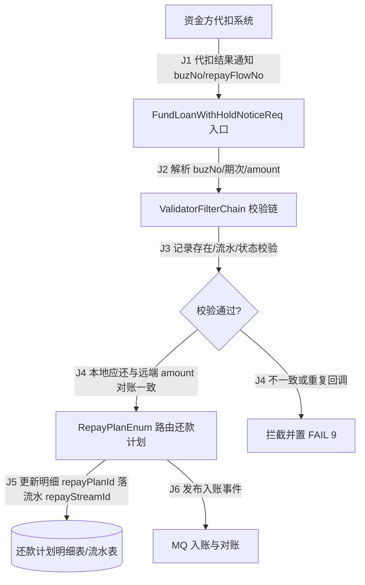

# 代扣结果通知端到端测试计划（asset_loan / 分期乐资方代扣）

> 真实仓库取样：`/Users/hex1n/Workspace/asset_loan`（hfax_loan_service）。本计划为委派版（含执行器交接索引），用于验证 e2e-test-planner 在真实代码上的输出契约。

## 1. 来源清单

读取到的最小权威集：

- `hfax_loan_service/src/main/java/com/hfax/loan/service/fund/req/FundLoanWithHoldNoticeReq.java` — “8.1 代扣结果通知【分期乐】”回调入口，字段 `buzNo`（业务单号）、`amount`（还款总额，分）、`repayFlowNo`（还款流水号）、`repayTime`、`repayMode`、`repayChannel`、`compensateIndicate`、`repayInfo[]`（principle/interest/period/penalty）；`ZJBizType` 单期 PERIOD / 整单 SETTLE。
- `hfax_loan_service/src/main/java/com/hfax/loan/service/withhold/ValidatorFilterChain.java` — 代扣校验链，含 `PRIORITY_LOAN_RECORD_EXIST`、`PRIORITY_REPAY_DETAIL_RECORD_EXIST`、`PRIORITY_FLOWID_EXIST`、`PRIORITY_USER_REPEAT_REPAY`（幂等/重复还款）、`PRIORITY_LOCAL_AMOUNT` / `PRIORITY_REMOTE_AMOUNT`（金额对账）、`PRIORITY_LOAN_STATUS_VALIDA`。
- `hfax_loan_service/src/main/java/com/hfax/loan/service/repayapply/constant/ResultStatusEnum.java` — 结果状态 SUCCESS(10) / FAIL(9) / UNKNOWN(-1) / DEFAULT_VALUE(-2)。
- `hfax_loan_service/src/main/java/com/hfax/loan/service/repayplan/RepayPlanEnum.java` — 按 `productCode` 路由的还款计划实现（如 `miniRepayPlanService`、`p2pRepayPlanService`），消费 `repayPlanId` 更新明细。

变量源证（下游 DAG 引用的命名变量均在此处取证）：`buzNo`、`repayFlowNo`、`amount`、`repayPlanId`、`repayStreamId`、`loanId`、`productCode`。

完成判据：每个命名来源都已落到具体文件；金额对账“本地应还 vs 远端 `amount`”的判定阈值口径在代码中未直接给出，标记为未源证。范围外：放款（提现）链路与对账日切作业不在本计划内。

## 2. 业务流程图 + 旅程图

旅程图：

| 边 | 起点→终点 | 动作 | 消费/依赖 | 产物 | 状态/副作用 | 来源证据 |
|---|---|---|---|---|---|---|
| J1 | 资方→入口 | 推送代扣结果 | 资方报文 | `buzNo`、`repayFlowNo` | 收到回调 | `FundLoanWithHoldNoticeReq.java` |
| J2 | 入口→校验链 | 解析报文 | `buzNo`、期次、`amount` | 规范化入参 | 无写库 | `FundLoanWithHoldNoticeReq.java` |
| J3 | 校验链→判定 | 记录/流水/状态校验 | `loanId`、`repayFlowNo` | 校验结果 | 命中 `PRIORITY_*` 规则 | `ValidatorFilterChain.java` |
| J4 | 判定→路由/拦截 | 金额对账与幂等 | 本地 `repayPlanId`、远端 `amount` | 通过或 FAIL(9) | `PRIORITY_USER_REPEAT_REPAY`/`PRIORITY_REMOTE_AMOUNT` | `ValidatorFilterChain.java`、`ResultStatusEnum.java` |
| J5 | 路由→落库 | 更新明细+落流水 | `repayPlanId` | `repayStreamId` | 写还款计划明细表/流水表 | `RepayPlanEnum.java` |
| J6 | 路由→MQ | 发布入账事件 | `buzNo` | 入账事件 | 异步入账/对账 | `RepayPlanEnum.java` |

输出：每条边给出消费/依赖与产物。完成判据：图中每条边都在表内有消费、产物、状态/副作用与来源；金额对账阈值为来源缺口（见 §8）。

## 3. Agent 执行契约

- 目标面：代扣结果通知 API `FundLoanWithHoldNoticeReq`（J1），校验链 `ValidatorFilterChain`（J4），还款计划路由 `RepayPlanEnum`（J5）。
- 测试数据：放款成功借据 `loanId`、`buzNo`、待还期次（J2），资金方代扣替身与 `productCode` 映射（J3），金额对账口径数据（J4）。
- 变量传递：J1 回调产出 `buzNo`、`repayFlowNo`；J5 消费 `repayPlanId` 更新明细并产出 `repayStreamId`。
- 探针/Oracle：J5 后查还款计划明细表状态=已还、`repayStreamId` 入流水（DB+日志），J6 校验入账事件（event）。
- 等待/预算：J4 校验链同步返回；J6 入账事件异步轮询，超时预算≤30s。
- 隔离/清理：按 `buzNo` 前缀造数，J6 后按 `buzNo` 回滚流水与明细，避免污染对账。
- 阻塞/缺口：资金方代扣替身金额需与本地 `repayPlanId` 应还口径一致，否则 J4 对账阈值未源证、拦截边界不可判。

完成判据：每个场景都能交给执行 agent，无隐藏前置或歧义 Oracle；金额对账阈值与替身可用性列为阻塞/缺口。

## 4. 风险图谱

从旅程图派生，覆盖各风险族：

- 主路径：单期/整单代扣成功入账（J1→J6）。
- 幂等与恢复：资方重复推送同一 `repayFlowNo`，`PRIORITY_USER_REPEAT_REPAY` 应拦截，避免重复入账（J4）。
- 跨步一致性：本地应还与远端 `amount` 不一致时拦截并置 FAIL(9)，不得写库（J4）。
- 状态校验：借据/明细状态非法时 `PRIORITY_LOAN_STATUS_VALIDA` 拦截。
- 并发：同一 `buzNo` 并发回调写同一流水表的竞争。
- 可观测：拦截与入账需落日志/告警便于对账排障。

完成判据：每个校验链规则、状态迁移、对账分支、重复回调失败模式至少有一个场景或列为缺口。

## 5. 测试场景

### WITHHOLD-E2E-001 单期代扣成功入账
- 目的：验证资方单期代扣成功回调后，校验通过并按 `RepayPlanEnum` 更新明细、落流水、发入账事件（主链 J1-J6）。
- 优先级：P0。
- 来源：`FundLoanWithHoldNoticeReq.java`、`RepayPlanEnum.java`、`ResultStatusEnum.java`。
- 覆盖边：J1、J2、J3、J4、J5、J6。
- 准备：放款成功借据 `loanId`、待还期次、代扣 API 入口与资金方替身。
- 步骤和依赖：构造单期回调（消费 `buzNo`、`amount`），经校验链 J4 对账，J5 取 `repayPlanId` 更新并产出 `repayStreamId`。
- 期望：探针显示明细状态=已还、金额一致、`repayStreamId` 落库、J6 入账事件发布；断言无重复入账。
- 自动化级别：E2E。
- 隔离/清理：按 `buzNo` 前缀造数，结束后清理流水与明细。

### WITHHOLD-E2E-002 重复回调幂等
- 目的：同一 `repayFlowNo` 二次推送时 `PRIORITY_USER_REPEAT_REPAY` 命中，依赖 N1 已入账数据，不得重复写流水（J4）。
- 优先级：P0。
- 来源：`ValidatorFilterChain.java`（`PRIORITY_USER_REPEAT_REPAY`、`PRIORITY_FLOWID_EXIST`）。
- 覆盖边：J1、J3、J4。
- 准备：复用 WITHHOLD-E2E-001 入账后的 `buzNo`、`repayFlowNo`。
- 步骤和依赖：重放同一回调（取 `repayFlowNo`），观察校验链是否幂等拦截。
- 期望：探针确认流水表无新增、明细金额不变；断言一致性不变量保持。
- 自动化级别：API 集成。
- 隔离/清理：复用 N1 数据，按 `buzNo` 清理。

### WITHHOLD-E2E-003 金额不一致拦截
- 目的：远端 `amount` 与本地 `repayPlanId` 应还不一致时，`PRIORITY_REMOTE_AMOUNT` 拦截并置 FAIL(9)，不得写库（J4）。
- 优先级：P1。
- 来源：`ValidatorFilterChain.java`（`PRIORITY_LOCAL_AMOUNT`/`PRIORITY_REMOTE_AMOUNT`）、`ResultStatusEnum.java`。
- 覆盖边：J2、J3、J4。
- 准备：构造金额偏差的代扣替身报文（依赖 `buzNo`）。
- 步骤和依赖：提交偏差金额（消费 `amount`、`repayPlanId`），观察校验链拦截路径。
- 期望：探针确认返回 FAIL(9)、无资金写入、告警事件产生；断言数据一致。
- 自动化级别：API 集成。
- 隔离/清理：无资金写入，按 `buzNo` 清理校验日志。

完成判据：无场景假设不可达状态或隐藏前置结果。

## 6. 执行 DAG

按节点给出执行调度事实；不决定具体机器的运行时调度。

| 节点 | 场景 | 依赖 | 消费 | 产出 | 所需能力 | 副作用范围 | 隔离键 | 并行安全 | 清理依赖 | 扰动标记 |
|---|---|---|---|---|---|---|---|---|---|---|
| N1 | WITHHOLD-E2E-001 | J1-J6, 资金方代扣替身就绪 | `loanId`、`buzNo`、待还期次 | `buzNo`、`repayFlowNo`、`repayStreamId` | API、DB、MQ、job、stub | 还款计划明细表、流水表、入账事件 | `buzNo` 前缀 | 不安全：主链顺序消费产出流水 | J6 后按 `buzNo` 清理流水与明细 | 无 |
| N2 | WITHHOLD-E2E-002 | N1, J4 | `buzNo`、`repayFlowNo` | 幂等命中标记、`repayStreamId` | API、DB | 幂等校验、还款流水表 | `buzNo` 批次 | 不安全：与主链写同一流水表 | 复用 N1 数据后按 `buzNo` 清理 | 回调 |
| N3 | WITHHOLD-E2E-003 | J3-J4, 本地与远端金额账 | `buzNo`、远端 `amount`、本地 `repayPlanId` | 拦截结果 FAIL、告警事件 | API、DB、log | 仅告警事件，无资金写入 | `buzNo` 校验批次 | 安全：只读校验不写库存 | 无资金写入，按 `buzNo` 清理校验日志 | 无 |

完成判据：每个场景入 DAG；跨场景命名变量都有生产者或源证 fixture 与消费者；产出被消费的变量来自 `依赖` 中的前驱节点；DAG 无环；执行顺序可由 `依赖` 推导。

## 执行器交接索引

| Field | 值 |
|---|---|
| Artifact ID | withhold-notice-e2e-plan 2026-06-21 |
| Contract version | `e2e-plan/v1` |
| Plan source | `FundLoanWithHoldNoticeReq.java`、`ValidatorFilterChain.java`、`ResultStatusEnum.java`、`RepayPlanEnum.java`；金额对账阈值未源证 |
| Scenario set | WITHHOLD-E2E-001..003，默认节点 N1；无手工或阻塞场景 |
| DAG nodes | N1→001、N2→002、N3→003；依赖根 J1-J6；扰动 N2 回调、N1/N3 无 |
| Variable ledger | `buzNo`/`repayFlowNo` 由 J1 产出，`repayPlanId` 由 J5 消费产出 `repayStreamId`，清理按 `buzNo` |
| Required capabilities | API、DB、MQ、job、stub；无缺失门禁 |
| Cleanup anchors | `buzNo` 前缀批次，J6 入账后清理流水与明细，低留存风险 |
| Execution blockers | 金额对账阈值未源证（`PRIORITY_REMOTE_AMOUNT` vs `PRIORITY_LOCAL_AMOUNT` 判定口径） |

## 7. 覆盖矩阵

| 需求/风险族 | 旅程边 | 场景 |
|---|---|---|
| 主路径入账 | J1-J6 | WITHHOLD-E2E-001 |
| 幂等/重复回调 | J4 | WITHHOLD-E2E-002 |
| 金额对账一致性 | J4 | WITHHOLD-E2E-003 |

## 8. 缺口、假设与问题

- 金额对账阈值口径（容差、整单 vs 单期）在 `ValidatorFilterChain` 中以优先级规则体现，但具体判定值未在已读源码直接给出，列为来源缺口。
- 假设资金方代扣替身可复现 `repayFlowNo` 重复推送；若环境无替身，N2 降级为手工。
- 问题：`compensateIndicate=true`（代偿）是否走同一校验链未源证，暂不纳入。

## 9. 执行顺序

由 DAG `依赖` 推导的人读顺序：N1 → N2（复用 N1 入账数据）；N3 独立只读，可并行先行。本节为 DAG 投影，执行器仍以 `依赖` 为准。

## 10. Agent 就绪门禁

- 入口门禁：代扣 API 入口 `FundLoanWithHoldNoticeReq` 可达、资金方替身与 `productCode` 映射就绪、放款借据 `buzNo` 已造数。
- 退出门禁：还款计划明细状态与流水 `repayStreamId` 证据已保存、入账事件日志已捕获、按 `buzNo` 清理确认完成。
- 暂停门禁：金额对账阈值口径不可得或资金方替身不可用时暂停 N2/N3，避免误判拦截。

## 11. 最小自动化切片

先实现 WITHHOLD-E2E-001：目标面 `FundLoanWithHoldNoticeReq` 入口 + `RepayPlanEnum` 路由 + 还款计划明细表探针，覆盖主链 J1-J6。
