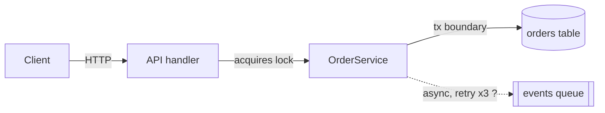
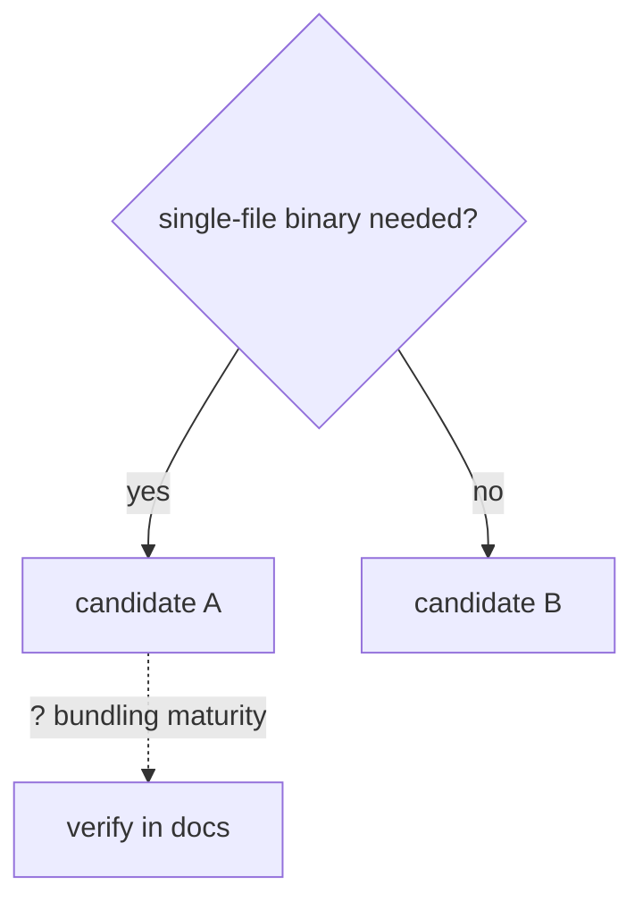

# Deep Research Reference

Use this file only when the main skill points here. Keep the investigation focused on the user's decision boundary.

## Current-State Research

Use current-state evidence when current reality is central to the question: actual behavior, runtime environment data, external-call results, persisted state, logs, UI/runtime state, relevant lookup keys, freshness windows, queued work, or "why does this current result look wrong?"

This is not mandatory for every investigation. Use it only when current state would materially affect the conclusion and the required tool is available. Prefer read-only or non-mutating checks. Do not trigger state-changing actions unless the user asks for them and the environment permits them. Do not replace an available current-state check with only synthetic evidence. If the required tool is unavailable, report that first.

Use or adapt this matrix:

| Scenario | Input | Invocation | Expected state | Observed state | Gap | Confidence |
|---|---|---|---|---|---|---|

Rules:

- Respect permissions and data minimization; inspect the smallest state needed.
- Separate before-state, action, after-state, and code explanation.
- Prefer observed state/results over hypothetical behavior when the question is about current reality.
- Record exact filters, lookup keys, freshness windows, and state boundaries used for lookup.
- Redact secrets, credentials, hosts, and connection strings from saved artifacts.
- If current state is mutable, include query time or state freshness.

## Session-History Research

For session histories, persistent memory, skills, automations, or repeated workflows, use the closest available session-history, profile, or workflow-analysis tool.

Raw session logs are noisy. Do not treat these as user intent without corroboration:

- metadata records; use them only for dates, paths, and environment facts
- injected system/developer instructions
- full skill bodies injected into prompts, unless the skill itself is the target
- tool outputs; use them for command/result corroboration, not intent
- approval or safety-review transcripts
- delegated task scaffolding, unless the task itself is the evidence

Prefer:

- explicit user prompts
- assistant commentary and final messages
- memory, summaries, and handoffs
- saved artifacts produced by the session

When keyword matching is used, keep a false-positive note and manually inspect representative samples.

## Research-To-Work Handoff

`deep-research` produces understanding. If research naturally leads to implementation, write or emit this handoff before any implementation step; if edits are not requested, stop there:

```md
Decision:
- ...
Evidence:
- ...
Risk:
- ...
Verification:
- ...
Next workflow:
- implementation | review | TDD | documentation | stop
```

The handoff should be copyable by an implementation pass. Do not bury the decision in prose.

## Broad Task Staging

For "deeply understand everything", "entire project", "every detail", or "generate docs and diagrams" requests:

1. Produce source inventory and boundaries.
2. Identify the first useful slice or decision.
3. Build the core flow.
4. Add edge cases and current-state evidence only where they change conclusions.
5. End with risks, open questions, and next slices.

Stop if the investigation keeps expanding faster than it converges. Report the staged result instead of chasing every branch.

## Output Patterns

Use the user's language for headings and table labels. Use tables for comparisons and reconciliation, diagrams for flows, narrative for causal chains, and bullets for edge cases/checklists.

### Research Closure Check

Use this before Standard/Deep final answers to convert evidence into a bounded conclusion. Keep it compact in chat; expand it only for saved findings or high-risk decisions.

| Field | Question it must answer |
|---|---|
| Settled answer | What is now answered under the stated decision boundary? |
| Confidence basis | Which independent evidence lanes support it, and which lane conflicts remain? |
| Strongest unresolved counterexample | What rival explanation, edge case, or missing source could still matter? |
| Flip condition | What specific evidence would change or downgrade the conclusion? |
| Stop reason | Why should the investigation stop now, or what one next check is still worth running? |

If the stop reason is weak, run one more distinguishing check or lower confidence. If the flip condition is broad or unknowable, narrow the decision boundary instead of pretending the question is settled.

### Saved Artifact Headers

Standard/Deep saved findings open with a header whose fields are question, depth, core conclusion, artifact type, verification status, and open-question count, labeled in the user's language. English labels: `Question`, `Depth`, `Core conclusion`, `Artifact type`, `Verification status`, `Open questions`. For Chinese Standard/Deep saved findings:

```md
**问题**: ...
**深度**: Standard | Deep
**核心结论**: ...
**产物类型**: canonical | supporting | temporary
**验证状态**: code-only | current-state checked | external-call tested | UI/runtime tested | not run
**开放问题**: N - 见文末
```

Before saving, verify the header and body agree. If the open-question count `N` is present, include exactly N open questions in a matching body section; do not count risks as open questions unless they are phrased as unresolved questions. Put `## TL;DR` in the body after the header only when it adds non-duplicative scan value: implications, risks, key evidence, current status, or next actions. Omit it when it would only restate the core conclusion.

### Orientation Diagrams

Orient before deep evidence gathering; refine the orientation in the final output.

Choose the smallest orientation form that clarifies the decision boundary:

- Mermaid flowchart: architecture boundary, control/data flow, component responsibility.
- Mermaid sequenceDiagram: ordered protocol, request lifecycle, async handoff.
- Mermaid stateDiagram: lifecycle or state transition questions.
- ASCII: quick chat answers or terminals where rendering may fail.
- Table: version/environment gates, option comparison, claim/source audit.
- No diagram: when one sentence or a table is clearer.

Every orientation form must be decision-shaped: name what question it orients, keep only scoped components, label edges or fields with decision-relevant mechanisms, and mark unverified elements with `?`. After a diagram or table, add one sentence stating what it establishes and what remains unverified. Mermaid is the default for saved artifacts when a graph helps; ASCII is a fallback, not the default.

Codebase (one domain — a transactional service; adapt the edge labels to your question):



Establishes: request path, lock, and transaction boundary; still unverified: async retry behavior.

External (option comparison / decision):



Establishes: the option split; still unverified: candidate A's bundling maturity.

ASCII fallback for chat:

```
Client -> API handler -> OrderService -> (orders table)
                              \-- ? --> [events queue]   (unverified)
```

For version/environment applicability, use a compact gate table: `Gate | Evidence | Result`.

For Standard/Deep source audit in Chinese requests:

| 主张 | 来源 | 获取方式 |
|---|---|---|
| ... | path, URL, command, current-state result | read/fetched/ran/queried/invoked in this session |

For unresolved contradictions in Chinese requests:

```md
矛盾:
- 来源 A 说 ...
- 来源 B 说 ...
- 区分性检查: ...
- 状态: 已通过 ... 解决 | 仍开放，因为 ...
```

## Worked Example

A compressed Standard run. What transfers is the decisions — what was skipped, what earned a second check, when it stopped — not the sequence; a real run follows uncertainty, not these paragraphs in order.

Request: "为什么订单创建偶尔超时？" No reproduction or fix was asked, so this stays in deep-research; had the user said "帮我修一下", it would route to diagnose instead.

Standard, not Deep: several components and a causal question, but no irreversible decision rides on the answer. No written plan either — the whole investigation hangs on one unknown, stated in one line: is event publishing inside the transaction boundary?

Reading `OrderService.create()` settled that directly: publish happens inside `@Transactional` (`src/.../OrderService.java:88`). The same read produced the orientation for free — Client → API → OrderService → DB in one transaction, publish inside it — so no separate diagram pass was needed; one structural sentence carried it.

Code alone proves "could be slow", not "is the cause", and a rival explanation — DB lock contention — was still alive. That made a second lane worth its cost: slow traces in the app logs spend ~2s in the publish span when the broker is degraded, with no lock-wait time. The lock hypothesis dies on expected-but-absent evidence, not just on the winner looking good.

One attack before concluding: if publish-in-transaction were the cause, healthy-broker periods should show no timeouts. The same logs confirm it. A third lane (DB metrics) could only re-confirm what two lanes already agree on, so the investigation stops there.

Delivered as a causal trace in chat: conclusion first, mechanism, two receipts, weakest point named (only three days of logs). No save trigger fired — no file requested, no handoff — so it ends with a one-line offer to save, not a file.
