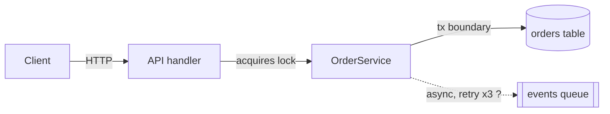
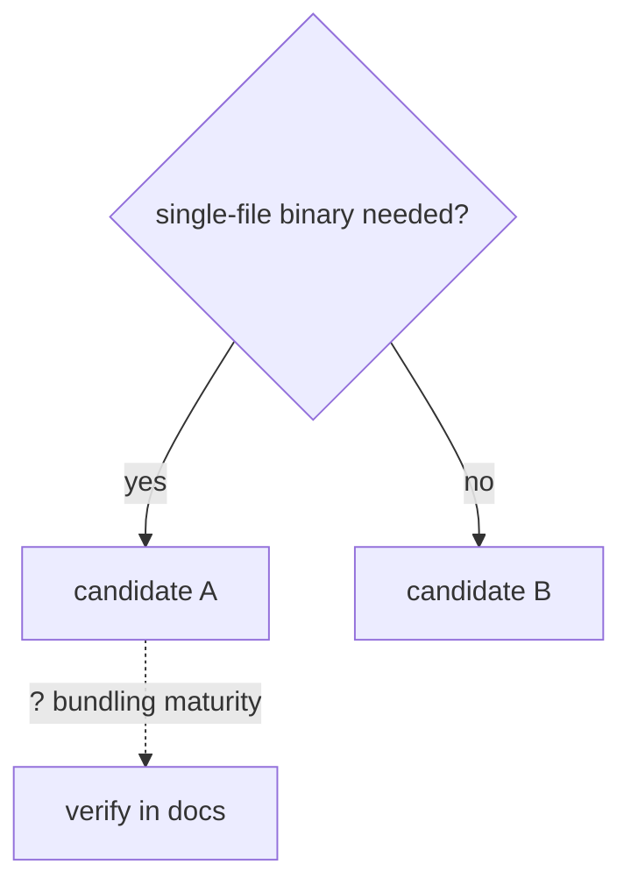

# Deep Research Reference

Use this file only when the main skill points here. Keep the investigation focused on the user's decision boundary.

## Current-State Research

Use current-state evidence when current reality is central to the question: actual behavior, runtime environment data, external-call results, persisted state, logs, UI/runtime state, relevant lookup keys, freshness windows, queued work, or "why does this current result look wrong?"

This is not mandatory for every investigation. Use it only when current state would materially affect the conclusion and the required tool is available. Prefer read-only or non-mutating checks. Do not trigger state-changing actions unless the user asks for them and the environment permits them. Do not replace an available current-state check with only synthetic evidence. If the required tool is unavailable, report that first.

Use or adapt this matrix:

| Scenario | Input | Invocation | Expected state | Observed state | Gap | Confidence |
|---|---|---|---|---|---|---|

Rules:

- Respect permissions and data minimization; inspect the smallest state needed.
- Separate before-state, action, after-state, and code explanation.
- Prefer observed state/results over hypothetical behavior when the question is about current reality.
- Record exact filters, lookup keys, freshness windows, and state boundaries used for lookup.
- Redact secrets, credentials, hosts, and connection strings from saved artifacts.
- If current state is mutable, include query time or state freshness.

## Session-History Research

For session histories, persistent memory, skills, automations, or repeated workflows, use the closest available workflow-compounding, profile, or history-analysis tool.

Raw session logs are noisy. Do not treat these as user intent without corroboration:

- metadata records; use them only for dates, paths, and environment facts
- injected system/developer instructions
- full skill bodies injected into prompts, unless the skill itself is the target
- tool outputs; use them for command/result corroboration, not intent
- approval or safety-review transcripts
- delegated task scaffolding, unless the task itself is the evidence

Prefer:

- explicit user prompts
- assistant commentary and final messages
- memory, summaries, and handoffs
- saved artifacts produced by the session

When keyword matching is used, keep a false-positive note and manually inspect representative samples.

## Research-To-Work Handoff

`deep-research` produces understanding. If research naturally leads to implementation, write or emit this handoff before any implementation step; if edits are not requested, stop there:

```md
Decision:
- ...
Evidence:
- ...
Risk:
- ...
Verification:
- ...
Next workflow:
- implementation | review | TDD | documentation | stop
```

The handoff should be copyable by an implementation pass. Do not bury the decision in prose.

## Broad Task Staging

For "deeply understand everything", "entire project", "every detail", or "generate docs and diagrams" requests:

1. Produce source inventory and boundaries.
2. Identify the first useful slice or decision.
3. Build the core flow.
4. Add edge cases and current-state evidence only where they change conclusions.
5. End with risks, open questions, and next slices.

Stop if the investigation keeps expanding faster than it converges. Report the staged result instead of chasing every branch.

## Output Patterns

Use the user's language for headings and table labels. Use tables for comparisons and reconciliation, diagrams for flows, narrative for causal chains, and bullets for edge cases/checklists.

### Saved Artifact Headers

For Chinese Standard/Deep saved findings:

```md
**问题**: ...
**深度**: Standard | Deep
**核心结论**: ...
**TL;DR**: ...
**产物类型**: canonical | supporting | temporary
**验证状态**: code-only | current-state checked | external-call tested | UI/runtime tested | not run
**开放问题**: N - see end.
```

### Orientation Diagrams

Produce the step-2 orientation map before deep evidence gathering, then refine it in the final output. Use Mermaid in saved artifacts; Mermaid or ASCII in chat. Keep it to the components in scope, not the whole system. For codebase maps, label the edges the question turns on — whatever is decision-relevant for that domain (a transactional service: tx boundaries and locks; a UI: state and effect flow; a pipeline: transforms and idempotency; most things: concurrency and failure/retry) — not just component names. Mark unverified nodes or edges with `?`; keep the `?` on anything still unverified in the final map.

Codebase (one domain — a transactional service; adapt the edge labels to your question):



External (option comparison / decision):



ASCII fallback for chat:

```
Client -> API handler -> OrderService -> (orders table)
                              \-- ? --> [events queue]   (unverified)
```

For version/environment applicability, use a compact gate table: `Gate | Evidence | Result`.

For Standard/Deep source audit in Chinese requests:

| 主张 | 来源 | 获取方式 |
|---|---|---|
| ... | path, URL, command, current-state result | read/fetched/ran/queried/invoked in this session |

For unresolved contradictions in Chinese requests:

```md
矛盾:
- 来源 A 说 ...
- 来源 B 说 ...
- 区分性检查: ...
- 状态: 已通过 ... 解决 | 仍开放，因为 ...
```
