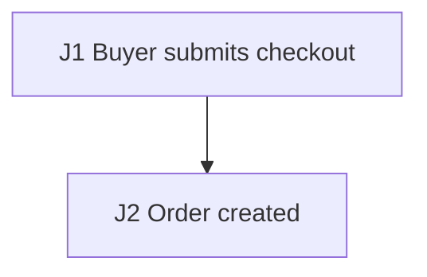

# Synthetic Checkout E2E Test Plan

## Source Inventory

- `docs/checkout-prd.md`: checkout requirements.

## Business Flow Diagram + Journey Graph

| Edge | Action | Consumes | Produces | State / Side Effects | Source Receipt |
| --- | --- | --- | --- | --- | --- |
| J1 | Buyer submits checkout | buyer and cart | `orderId` | order exists | `docs/checkout-prd.md` |
| J2 | Record order | `orderId` | persisted order | checkout committed | `src/orders` |

## Agent Execution Contract

- Target surfaces: checkout API and order table.
- Fixtures: buyer account and cart.
- Named variables: `orderId` is handed from J1 to J2.
- Probes/Oracles: assert the order table.
- Waits: no async wait is needed.
- Cleanup: delete by `orderId`.
- Blockers/Gaps: payment callback target is not sourced.

## Risk Map

- Main path and duplicate payment callbacks.

## Test Scenarios

### E2E-001 Checkout completes

- Purpose/Risk: Cover checkout.
- Priority: P0.
- Sources: `docs/checkout-prd.md`.
- Edges: J1, J2.
- Setup: Buyer account.
- Steps: Submit checkout.
- Expected: Order exists.
- Automation: E2E API integration.
- Isolation/Cleanup: Delete by `orderId`.
