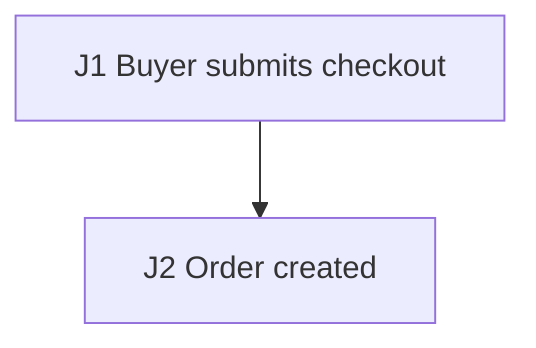

# Thin Agent Contract E2E Plan

## Source Inventory

- `docs/checkout-prd.md`: checkout requirements.

## Business Flow Diagram + Journey Graph

| Edge | Action | Consumes | Produces | State / Side Effects | Source Receipt |
| --- | --- | --- | --- | --- | --- |
| J1 | Buyer submits checkout | `cartId` | `orderId` | order exists | `docs/checkout-prd.md` |
| J2 | Record order | `orderId` | persisted order | checkout committed | `src/orders` |

## Agent Execution Contract

- Target surfaces: TBD.
- Fixtures: TBD.
- Named variables: TBD.
- Probes/Oracles: TBD.
- Waits: TBD.
- Cleanup: TBD.
- Blockers/Gaps: TBD.

## Risk Map

- Main path and duplicate payment callbacks.

## Test Scenarios

### CHECKOUT-E2E-001 Checkout completes

- Purpose/Risk: Cover checkout.
- Priority: P0.
- Sources: `docs/checkout-prd.md`.
- Edges: J1, J2.
- Setup: checkout API, order table, and gateway stub.
- Steps: Create cart and capture `cartId`; submit checkout and capture `orderId`.
- Expected: Probe the order API and wait for committed order state.
- Automation: E2E API integration.
- Isolation/Cleanup: Delete by `orderId`.

## Execution DAG

| Node | Scenario | Depends on | Consumes | Produces | Required capabilities | Side-effect scope | Isolation key | Parallel safety | Cleanup dependency | Disruptive marker |
| --- | --- | --- | --- | --- | --- | --- | --- | --- | --- | --- |
| N1 | CHECKOUT-E2E-001 | J1-J2 | `cartId` | `orderId` | API, DB, stub | order table | `orderId` prefix | unsafe: order creation consumes checkout output | after order API probe, cleanup by `orderId` | none |

## Coverage Matrix

| Risk | Scenario |
| --- | --- |
| J1-J2 checkout | CHECKOUT-E2E-001 |

## Gaps, Assumptions, Questions

- none

## Execution Order

1. Run CHECKOUT-E2E-001.

## Agent-ready Gates

- Entry: checkout API, order table, and gateway stub are available.
- Exit: CHECKOUT-E2E-001 captures `orderId`, order API probe, and cleanup evidence.
- Suspend: stop if cleanup by `orderId` is unavailable.

## Minimal First Automation Slice

Run CHECKOUT-E2E-001.
