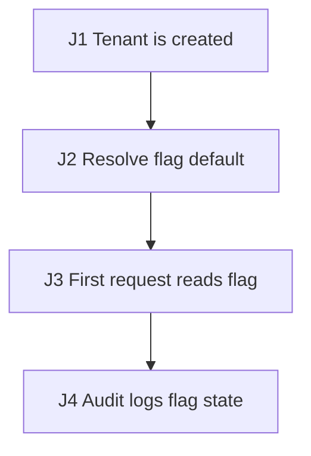

# Synthetic Feature-Flag Rollout E2E Test Plan

## 1. Source Inventory

- `docs/flag-spec.md`: flag default rollout contract.
- `src/flags`: flag default resolution.
- `src/tenant`: tenant creation and flag read path.

## 2. Business Flow Diagram + Journey Graph

| Edge | Action | Consumes | Produces | State / Side Effects | Source Receipt |
| --- | --- | --- | --- | --- | --- |
| J1 | Tenant is created | `tenantId`, creation date | tenant record | Tenant ready | `docs/flag-spec.md` |
| J2 | Resolve flag default | `tenantId` | `flagState` | Default chosen by creation date | `src/flags` |
| J3 | First request reads flag | `tenantId`, `flagState` | request result | Flag applied to behavior | `src/tenant` |
| J4 | Audit logs flag state | `flagState` | `auditId` | Audit row written | `docs/flag-spec.md` |

## 3. Agent Execution Contract

- Target surfaces: J1-J2 use `POST /tenants` plus the flag table; J3 uses `GET /feature/state`; J4 uses the audit query for `auditId`.
- Fixtures: J1 a fresh `tenantId`, a creation date after the rollout date, and J2 the flag default config.
- Named variables: `tenantId` from J1, `flagState` from J2, and `auditId` from J4 are handed forward.
- Probes/Oracles: J2-J4 assert through the flag API, the flag table, and the audit row.
- Waits: J4 polls the audit query until `auditId` exists or the timeout budget expires.
- Cleanup: J1-J4 delete by `tenantId` and clear the audit row.
- Blockers/Gaps: the rollout date boundary semantics are not fully sourced.

## 4. Risk Map

- Main path: a post-rollout tenant gets the documented default.
- Consistency: the flag table, the read path, and the audit row agree.
- Recovery: re-resolving the default is idempotent.

## 5. Document-Code Semantic Diff

| Contract | Code behavior | Delta | Risk | Resolution |
| --- | --- | --- | --- | --- |
| Doc: flag defaults ON for tenants created after the rollout date (`docs/flag-spec.md §3`) | code defaults the flag OFF regardless of date (`src/flags/Defaults.java:42`) | documented default never applied | P1 | `DC-E2E-002` |
| Doc: legacy tenants keep their prior flag (`docs/flag-spec.md §4`) | unclear whether code preserves or overwrites | unconfirmed product call | P1 | blocked: product owner to confirm legacy handling |

## 6. Test Scenarios

### DC-E2E-001 Post-rollout tenant default (main path)

- Purpose/Risk: Cover the documented default for a tenant created after the rollout date.
- Priority: P0.
- Sources: `docs/flag-spec.md`, `src/flags`.
- Edges: J1, J2, J3.
- Setup: A fresh `tenantId` with a creation date after the rollout date, the flag default config, and `POST /tenants`.
- Steps: Create the tenant and capture `tenantId`; resolve the default and capture `flagState`; read the flag on J3; the chain consumes `tenantId`.
- Expected: Probes assert `flagState` matches the documented default; an invariant holds that the read path and the flag table agree after the wait.
- Automation: E2E API integration.
- Isolation/Cleanup: Delete by `tenantId`.

### DC-E2E-002 Documented default vs code default delta

- Purpose/Risk: Verify the documented post-rollout default actually applies, since the code default may diverge.
- Priority: P0.
- Sources: `docs/flag-spec.md`, `src/flags`.
- Edges: J2, J4.
- Setup: Run DC-E2E-001 first; target the default resolver `src/flags`.
- Steps: Resolve the default for a post-rollout `tenantId`; capture `flagState` and the `auditId`; the check consumes `tenantId`.
- Expected: Probe asserts `flagState` equals the documented default, or the divergence is recorded as an invariant violation to fix; wait for the audit row.
- Automation: E2E API integration.
- Isolation/Cleanup: Delete by `tenantId` and clear the audit row.

## 7. Execution DAG

| Node | Scenario | Depends on | Consumes | Produces | Required capabilities | Side-effect scope | Isolation key | Parallel safety | Cleanup dependency | Disruptive marker |
| --- | --- | --- | --- | --- | --- | --- | --- | --- | --- | --- |
| N1 | DC-E2E-001 | J1-J4, flag config ready | `tenantId`, creation date | `flagState`, `auditId` | API, DB, job | flag, tenant, audit tables | `tenantId` batch prefix | unsafe: chain consumes produced ids in order | after audit probe, cleanup by `tenantId` | none |
| N2 | DC-E2E-002 | N1 | `tenantId`, `flagState` | `deltaResult` | API, DB | flag, audit tables | `tenantId` batch prefix | unsafe: depends on N1 default | after audit probe, cleanup by `tenantId` | none |

## 8. Coverage Matrix

| Edge/Risk | Scenario |
| --- | --- |
| J1-J3 default resolution | DC-E2E-001 |
| Doc-code default delta | DC-E2E-002 |

## 9. Gaps, Assumptions, Questions

- Legacy-tenant flag handling is unconfirmed and tracked as blocked.
- The rollout date boundary is only partially sourced.

## 10. Execution Order

1. Run DC-E2E-001, then DC-E2E-002.

## 11. Agent-ready Gates

- Entry: `POST /tenants`, `GET /feature/state`, the flag table, and the audit query are available.
- Exit: DC-E2E-001 and DC-E2E-002 capture `tenantId`, `flagState`, `auditId`, API/DB probes, and cleanup evidence.
- Suspend: stop if the flag config, the default resolver, or cleanup by `tenantId` is unavailable.

## 12. Minimal First Automation Slice

Automate the post-rollout default and the doc-code delta check first.
