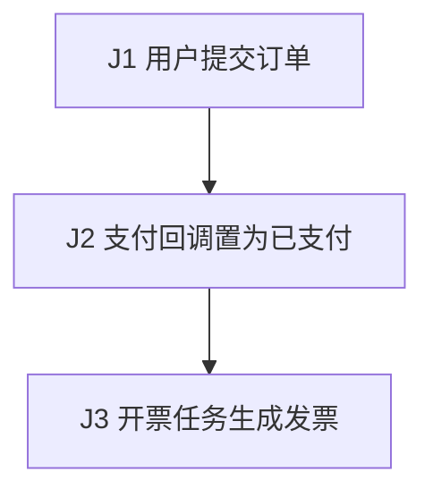

# 订单端到端测试计划

## 1. 来源清单

- `docs/order-prd.md`：订单生成、支付回调、开票要求。
- `src/order`：订单状态和持久化。
- `src/payment`：支付回调幂等。

## 2. 业务流程图

| 边 | 动作 | 依赖/输入 | 输出/产物 | 状态/副作用 | 来源/证据 |
| --- | --- | --- | --- | --- | --- |
| J1 | 用户提交订单 | 用户和商品 | `orderId` | 订单待支付 | `docs/order-prd.md`、`src/order` |
| J2 | 支付回调 | `orderId`、`paymentEventId` | 已支付状态 | 回调事件落库 | `docs/order-prd.md`、`src/payment` |
| J3 | 开票任务 | 已支付 `orderId` | `invoiceId` | 发票可查询 | `docs/order-prd.md` |

## 3. Agent 执行契约

- 目标面：J1 使用 `POST /orders` 和订单表；J2 使用支付回调入口、支付事件表和支付网关测试替身；J3 使用开票任务。
- 测试数据：J1 买家账号和可售商品，J2 支付网关测试替身。
- 变量传递：J1 产生 `orderId`，J2 消费 `orderId` 并产生 `paymentEventId`，J3 消费已支付 `orderId` 并产生 `invoiceId`。
- 探针/Oracle：J1-J3 通过订单查询、支付事件记录和发票查询断言状态。
- 等待/预算：J3 等待开票任务生成 `invoiceId`，超过异步超时预算则失败。
- 隔离/清理：J1-J3 按 `orderId/paymentEventId/invoiceId` 删除订单、支付事件和发票记录，并重置测试替身。
- 阻塞/缺口：支付网关超时 SLA 没有来源证据。

## 4. 风险图谱

- 主链路：订单创建到支付完成再到发票可查。
- 一致性：订单、支付事件、发票记录必须一致。
- 并发：重复支付回调不能重复开票。

## 5. 测试场景

### 订单-E2E-001 支付成功后生成发票

- 目的：覆盖订单到支付再到发票的依赖链。
- 优先级：P0。
- 来源：`docs/order-prd.md`，`src/order`，`src/payment`。
- 覆盖边：J1、J2、J3。
- 准备：买家账号、可售商品、支付网关测试替身、订单创建 API、支付回调入口和开票任务。
- 步骤和依赖：创建订单并取 `orderId`；发送支付回调并取 `paymentEventId`；触发开票任务并等待 `invoiceId`。
- 期望：断言探针显示订单为已支付；发票引用同一个 `orderId`；重复回调不产生第二张发票。
- 自动化级别：API integration。
- 隔离/清理：按 `orderId/paymentEventId/invoiceId` 删除订单、支付事件和发票记录。

## 6. 覆盖矩阵

| 链路/风险 | 场景 |
| --- | --- |
| J1-J3 订单 -> 支付 -> 发票 | 订单-E2E-001 |
| J2 重复回调幂等 | 订单-E2E-001 |

## 7. 缺口、假设与问题

- 支付网关超时和撤销不在首个切片内。

## 8. 执行顺序

1. 先运行订单-E2E-001。

## 9. Agent 就绪门禁

- 入口门禁：`POST /orders`、支付回调入口、开票任务和支付网关测试替身可用。
- 退出门禁：订单-E2E-001 保存 `orderId`、`paymentEventId`、`invoiceId`、API/DB 探针和清理证据。
- 暂停门禁：无法控制支付网关替身、无法触发开票任务或无法按 `orderId` 清理时暂停。

## 10. 最小自动化切片

先自动化订单创建、一次成功支付回调、开票断言和重复回调幂等断言。
