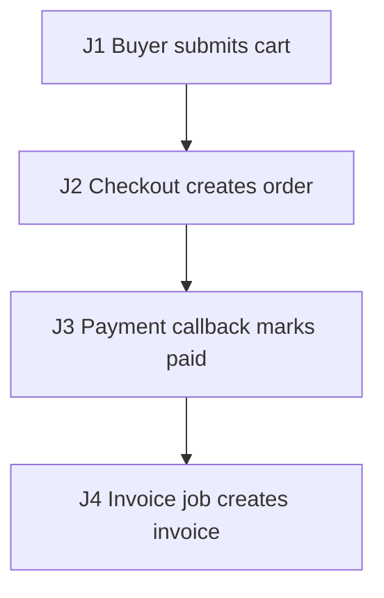

# Synthetic Checkout E2E Test Plan

## 1. Source Inventory

- `docs/checkout-prd.md`: checkout requirements.
- `src/orders`: order state transitions.
- `src/payments`: payment callback handling.

## 2. Business Flow Diagram + Journey Graph

| Edge | Action | Consumes | Produces | State / Side Effects | Source Receipt |
| --- | --- | --- | --- | --- | --- |
| J1 | Buyer submits cart | `userId`, cart items | `cartId` | Cart ready for checkout | `docs/checkout-prd.md` |
| J2 | Checkout creates order | `cartId` | `orderId`, payment intent | Stock reservation opened | `src/orders` |
| J3 | Payment callback marks paid | `orderId`, `paymentEventId` | paid order state | Callback id recorded | `src/payments` |
| J4 | Invoice job creates invoice | paid `orderId` | `invoiceId` | Invoice references order | `docs/checkout-prd.md` |

## 3. Agent Execution Contract

- Target surfaces: J1-J2 use `POST /checkout` plus order/stock tables; J3 uses payment callback endpoint and provider stub; J4 uses invoice worker trigger.
- Fixtures: J1 buyer account, stocked SKU, seeded cart, and J3 payment provider stub.
- Named variables: `cartId` from J1, `orderId` and `paymentIntentId` from J2, `paymentEventId` from J3, and `invoiceId` from J4 are handed forward.
- Probes/Oracles: J2-J4 assert through order API, stock record, callback ledger, and invoice query.
- Waits: J4 polls invoice worker until `invoiceId` exists or the async timeout budget expires.
- Cleanup: J1-J4 delete by `orderId`, release stock reservation, clear callback ledger entry, and reset provider stub.
- Blockers/Gaps: payment-provider timeout SLA is not sourced.

## 4. Risk Map

- Main path: checkout to paid invoice.
- Consistency: order, stock, payment, and invoice agree.
- Concurrency: duplicate checkout submissions and duplicate payment callbacks.
- Recovery: payment callback after invoice worker failure.

## 5. Test Scenarios

### CHECKOUT-E2E-001 Checkout completes and emits invoice

- Purpose/Risk: Cover the main dependent workflow from checkout through async invoice.
- Priority: P0.
- Sources: `docs/checkout-prd.md`, `src/orders`, `src/payments`.
- Edges: J1, J2, J3, J4.
- Setup: Buyer account, stocked SKU, payment provider stub, `POST /checkout`, callback endpoint, and invoice worker trigger.
- Steps: Create cart and capture `cartId`; submit checkout and capture `orderId` plus `paymentIntentId`; pay with `paymentIntentId`; deliver callback with `paymentEventId`; wait for invoice job and capture `invoiceId`.
- Expected: Probes show order is paid; stock decreases once; invoice query references `orderId`; callback id is recorded after the wait.
- Automation: E2E API integration.
- Isolation/Cleanup: Delete by `orderId`, release stock reservation, reset provider stub.

## 6. Coverage Matrix

| Edge/Risk | Scenario |
| --- | --- |
| J1-J4 checkout -> payment -> invoice | CHECKOUT-E2E-001 |
| J3 duplicate callback idempotency | CHECKOUT-E2E-001 |

## 7. Gaps, Assumptions, Questions

- Payment-provider timeout behavior is not covered in this first slice.
- SLA targets are unverified.

## 8. Execution Order

1. Run CHECKOUT-E2E-001 against the provider stub.

## 9. Agent-ready Gates

- Entry: `POST /checkout`, callback endpoint, invoice worker trigger, and provider stub are available.
- Exit: CHECKOUT-E2E-001 captures `orderId`, `paymentEventId`, `invoiceId`, API/DB probes, and cleanup evidence.
- Suspend: stop if provider stub, invoice worker trigger, or cleanup by `orderId` is unavailable.

## 10. Minimal First Automation Slice

Automate checkout, one successful callback, and invoice assertion first.
