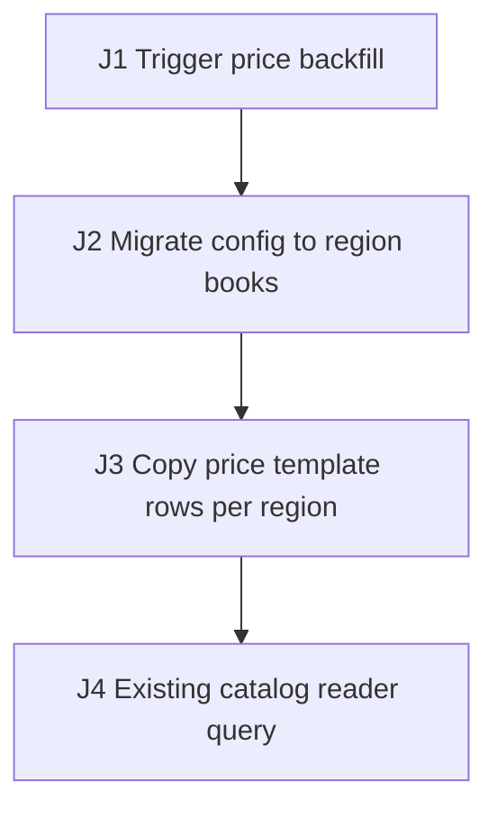

# Synthetic Price-Book Migration E2E Test Plan

## 1. Source Inventory

- `docs/pricebook-migration.md`: price backfill and per-region copy requirements.
- `src/migration`: config-to-region migration and price row copy.
- `src/pricing`: existing catalog price reader.

## 2. Business Flow Diagram + Journey Graph

| Edge | Action | Consumes | Produces | State / Side Effects | Source Receipt |
| --- | --- | --- | --- | --- | --- |
| J1 | Trigger price backfill job | `catalogId`, `marketId` | job run | Job context created | `docs/pricebook-migration.md` |
| J2 | Migrate config to region books | `catalogId` | `regionId` per variant | Region books inserted | `src/migration` |
| J3 | Copy price template rows per region | `regionId`, template rows | `priceRowId` sets | Price rows duplicated per region | `src/migration` |
| J4 | Existing catalog reader query | `catalogId` | catalog price read | Reads price rows without a region filter | `src/pricing` |

## 3. Agent Execution Contract

- Target surfaces: J1-J2 use `MigrationJobFacade.runJob` plus `price` and region-book tables; J3 copies rows via `PriceRowCopier`; J4 uses the existing `PriceMapper.selectByCatalog` reader.
- Fixtures: J1 seeded `catalogId` and `marketId`, J2 legacy template rows, and J3 a per-region book set.
- Named variables: `catalogId` and `marketId` seed J1; J2 produces `regionId`; J3 produces `priceRowId`; J4 reads by `catalogId`.
- Probes/Oracles: J3 and J4 assert through the `price` table row counts and the catalog reader result.
- Waits: J1 polls the migration job until the run completes or the timeout budget expires.
- Cleanup: J1-J4 delete copied rows and reset books by `catalogId`.
- Blockers/Gaps: the legacy reader's catalog-filter semantics are not fully sourced.

## 4. Risk Map

- Main path: migrate config, copy price rows per region, and keep existing readers correct.
- Migration read-path equivalence: the existing catalog reader that does not filter on `regionId` must stay equivalent after the copy.
- Recovery: a partial copy reruns without duplicating rows.

## 5. Migration Read-Path Risk Matrix

| Changed table/column | Change kind | Reader | Old assumption | New shape | Equivalence scenario | Expected decision |
| --- | --- | --- | --- | --- | --- | --- |
| `price` rows | row copy: 1 set -> N per-region sets | `PriceMapper.selectByCatalog` (filters `catalogId`, not `regionId`) | one template set per catalog | N duplicated sets per catalog | `PRICE-E2E-002` | must-change: reader needs `regionId` filter |
| `summary.regionKey` column | backfill | `ReportExporter.dailyByCatalog` (aggregates without the region key) | one aggregate per catalog | aggregate splits per region | `blocker` | blocker: report owner must confirm intended shape |

## 6. Test Scenarios

### PRICE-E2E-001 Migrate config and copy price rows per region

- Purpose/Risk: Cover the migration main path that creates region books and copies price template rows per region.
- Priority: P0.
- Sources: `docs/pricebook-migration.md`, `src/migration`.
- Edges: J1, J2, J3.
- Setup: Seed `catalogId` and `marketId`, legacy template rows, the migration trigger `MigrationJobFacade.runJob`, and a test DB.
- Steps: Trigger the backfill job; capture `regionId` per variant; verify J3 copies price rows and capture `priceRowId`; the chain consumes `catalogId` from setup.
- Expected: Probes assert region books exist; price rows are duplicated per `regionId`; an invariant holds that row count equals template count times region count after the wait.
- Automation: E2E API integration.
- Isolation/Cleanup: Delete copied rows and reset books by `catalogId`.

### PRICE-E2E-002 Existing catalog reader stays equivalent after copy

- Purpose/Risk: Verify the existing catalog reader that does not filter on `regionId` still returns equivalent results after rows are copied per region.
- Priority: P0.
- Sources: `src/pricing`, `docs/pricebook-migration.md`.
- Edges: J3, J4.
- Setup: Run PRICE-E2E-001 first so price rows are copied; target the existing reader `PriceMapper.selectByCatalog`.
- Steps: Query the catalog reader before and after the copy; capture both result sets; the check consumes `catalogId` and the `regionId` produced earlier.
- Expected: Probe asserts the reader result is equivalent with no duplicated rows, or the divergence is recorded as an invariant violation to fix; wait for read consistency.
- Automation: E2E API integration.
- Isolation/Cleanup: Delete copied rows by `catalogId`.

## 7. Execution DAG

| Node | Scenario | Depends on | Consumes | Produces | Required capabilities | Side-effect scope | Isolation key | Parallel safety | Cleanup dependency | Disruptive marker |
| --- | --- | --- | --- | --- | --- | --- | --- | --- | --- | --- |
| N1 | PRICE-E2E-001 | J1-J4, test DB ready | `catalogId`, `marketId` | `regionId`, `priceRowId` | API, RPC, DB, job | price, region-book tables | `catalogId` batch prefix | unsafe: migration mutates shared price rows | after read probe, cleanup by `catalogId` | none |
| N2 | PRICE-E2E-002 | N1 | `regionId`, `catalogId` | `readEquivResult` | API, DB | price table | `catalogId` batch prefix | unsafe: depends on N1 copied rows | after assertion, cleanup by `catalogId` | none |

## 8. Coverage Matrix

| Edge/Risk | Scenario |
| --- | --- |
| J1-J3 migration writes | PRICE-E2E-001 |
| J4 read-path equivalence | PRICE-E2E-002 |

## 9. Gaps, Assumptions, Questions

- The report exporter's intended per-region shape is unconfirmed and tracked as a blocker.
- Legacy reader catalog-filter semantics are only partially sourced.

## 10. Execution Order

1. Run PRICE-E2E-001, then PRICE-E2E-002.

## 11. Agent-ready Gates

- Entry: `MigrationJobFacade.runJob`, the `price` table, and a test DB are available.
- Exit: PRICE-E2E-001 and PRICE-E2E-002 capture `regionId`, `priceRowId`, read results, DB probes, and cleanup evidence.
- Suspend: stop if the migration trigger, the catalog reader, or cleanup by `catalogId` is unavailable.

## 12. Minimal First Automation Slice

Automate the migration and the catalog-reader equivalence check first.
