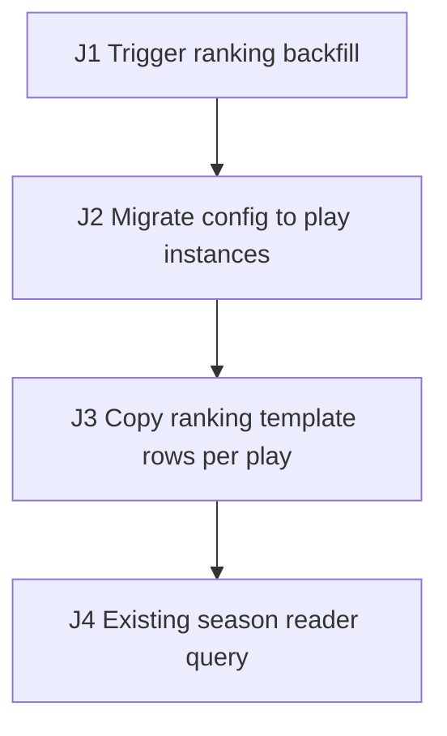

# Synthetic Ranking Migration E2E Test Plan

## 1. Source Inventory

- `docs/ranking-migration.md`: ranking backfill and per-play copy requirements.
- `src/migration`: config-to-play migration and ranking row copy.
- `src/ranking`: existing season ranking reader.

## 2. Business Flow Diagram + Journey Graph

| Edge | Action | Consumes | Produces | State / Side Effects | Source Receipt |
| --- | --- | --- | --- | --- | --- |
| J1 | Trigger ranking backfill job | `seasonId`, `divisionId` | job run | Job context created | `docs/ranking-migration.md` |
| J2 | Migrate config to play instances | `seasonId` | `playId` per variant | Play instances inserted | `src/migration` |
| J3 | Copy ranking template rows per play | `playId`, template rows | `rankingRowId` sets | Ranking rows duplicated per play | `src/migration` |
| J4 | Existing season reader query | `seasonId` | season ranking read | Reads ranking rows without a variant filter | `src/ranking` |

## 3. Agent Execution Contract

- Target surfaces: J1-J2 use `TaskTriggerFacade.taskTrigger` plus `ranking` and play-instance tables; J3 copies rows via `RankingCopier`; J4 uses the existing `RankingMapper.selectBySeason` reader.
- Fixtures: J1 seeded `seasonId` and `divisionId`, J2 legacy template rows, and J3 a per-variant play set.
- Named variables: `seasonId` and `divisionId` seed J1; J2 produces `playId`; J3 produces `rankingRowId`; J4 reads by `seasonId`.
- Probes/Oracles: J3 and J4 assert through the `ranking` table row counts and the season reader result.
- Waits: J1 polls the migration job until the run completes or the timeout budget expires.
- Cleanup: J1-J4 delete copied rows and reset instances by `seasonId`.
- Blockers/Gaps: the legacy reader's season-filter semantics are not fully sourced.

## 4. Risk Map

- Main path: migrate config, copy ranking rows per play, and keep existing readers correct.
- Migration read-path equivalence: the existing season reader that does not filter on `playId` must stay equivalent after the copy.
- Recovery: a partial copy reruns without duplicating rows.

## 5. Migration Read-Path Risk Matrix

| Changed table/column | Change kind | Reader | Old assumption | New shape | Equivalence scenario | Expected decision |
| --- | --- | --- | --- | --- | --- | --- |
| `ranking` rows | row copy: 1 set -> N per-play sets | `RankingMapper.selectBySeason` (filters `seasonId`, not `playId`) | one template set per season | N duplicated sets per season | `RANK-E2E-002` | must-change: reader needs `playId` filter |
| `summary.variantKey` column | backfill | `ReportExporter.dailyBySeason` (aggregates without the variant key) | one aggregate per season | aggregate splits per variant | `blocker` | blocker: report owner must confirm intended shape |

## 6. Test Scenarios

### RANK-E2E-001 Migrate config and copy ranking rows per play

- Purpose/Risk: Cover the migration main path that creates play instances and copies ranking template rows per play.
- Priority: P0.
- Sources: `docs/ranking-migration.md`, `src/migration`.
- Edges: J1, J2, J3.
- Setup: Seed `seasonId` and `divisionId`, legacy template rows, the migration trigger `TaskTriggerFacade.taskTrigger`, and a test DB.
- Steps: Trigger the backfill job; capture `playId` per variant; verify J3 copies ranking rows and capture `rankingRowId`; the chain consumes `seasonId` from setup.
- Expected: Probes assert play instances exist; ranking rows are duplicated per `playId`; an invariant holds that row count equals template count times variant count after the wait.
- Automation: E2E API integration.
- Isolation/Cleanup: Delete copied rows and reset instances by `seasonId`.

### RANK-E2E-002 Existing season reader stays equivalent after copy

- Purpose/Risk: Verify the existing season reader that does not filter on `playId` still returns equivalent results after rows are copied per play.
- Priority: P0.
- Sources: `src/ranking`, `docs/ranking-migration.md`.
- Edges: J3, J4.
- Setup: Run RANK-E2E-001 first so ranking rows are copied; target the existing reader `RankingMapper.selectBySeason`.
- Steps: Query the season reader before and after the copy; capture both result sets; the check consumes `seasonId` and the `playId` produced earlier.
- Expected: Probe asserts the reader result is equivalent with no duplicated rows, or the divergence is recorded as an invariant violation to fix; wait for read consistency.
- Automation: E2E API integration.
- Isolation/Cleanup: Delete copied rows by `seasonId`.

## 7. Execution DAG

| Node | Scenario | Depends on | Consumes | Produces | Required capabilities | Side-effect scope | Isolation key | Parallel safety | Cleanup dependency | Disruptive marker |
| --- | --- | --- | --- | --- | --- | --- | --- | --- | --- | --- |
| N1 | RANK-E2E-001 | J1-J4, test DB ready | `seasonId`, `divisionId` | `playId`, `rankingRowId` | API, RPC, DB, job | ranking, play-instance tables | `seasonId` batch prefix | unsafe: migration mutates shared ranking rows | after read probe, cleanup by `seasonId` | none |
| N2 | RANK-E2E-002 | N1 | `playId`, `seasonId` | `readEquivResult` | API, DB | ranking table | `seasonId` batch prefix | unsafe: depends on N1 copied rows | after assertion, cleanup by `seasonId` | none |

## 8. Coverage Matrix

| Edge/Risk | Scenario |
| --- | --- |
| J1-J3 migration writes | RANK-E2E-001 |
| J4 read-path equivalence | RANK-E2E-002 |

## 9. Gaps, Assumptions, Questions

- The report exporter's intended per-variant shape is unconfirmed and tracked as a blocker.
- Legacy reader season-filter semantics are only partially sourced.

## 10. Execution Order

1. Run RANK-E2E-001, then RANK-E2E-002.

## 11. Agent-ready Gates

- Entry: `TaskTriggerFacade.taskTrigger`, the `ranking` table, and a test DB are available.
- Exit: RANK-E2E-001 and RANK-E2E-002 capture `playId`, `rankingRowId`, read results, DB probes, and cleanup evidence.
- Suspend: stop if the migration trigger, the season reader, or cleanup by `seasonId` is unavailable.

## 12. Minimal First Automation Slice

Automate the migration and the season-reader equivalence check first.
